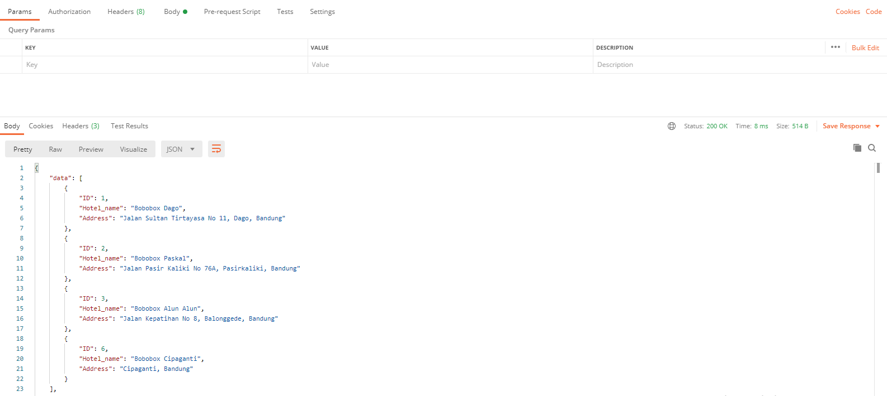
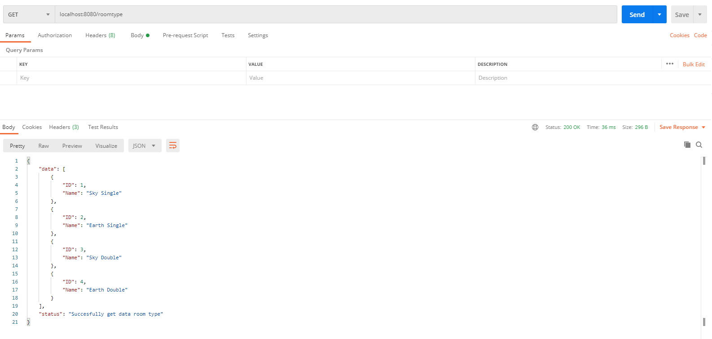
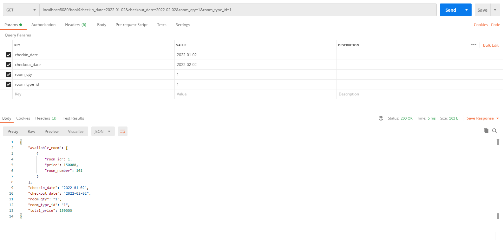
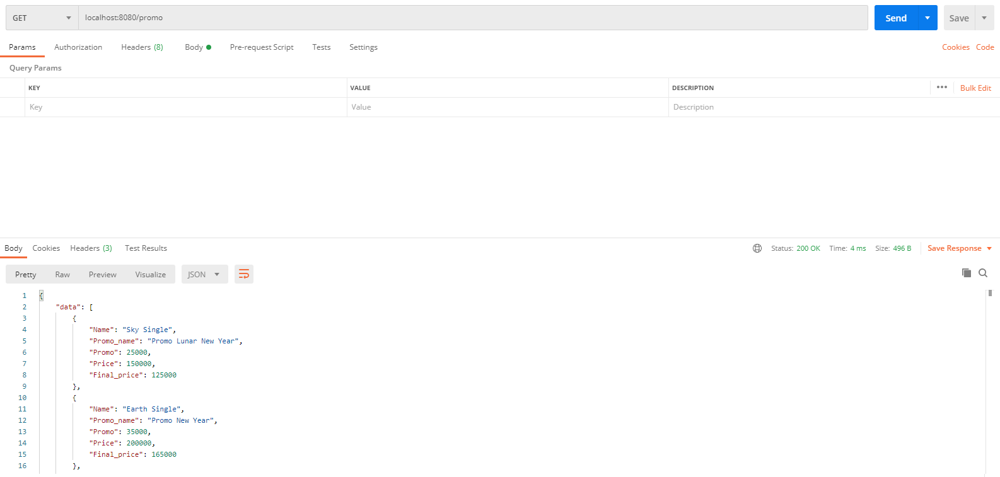
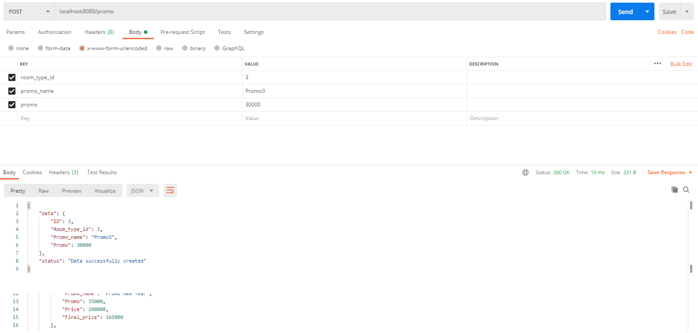

# reservationbox-api

# How to set up application

- Cloning git on this link : https://github.com/dikiyuliawan/reservationbox-api.git
- Create database : reservationbox-api
- Go to reservationbox-api's folder and run **go main run.go** on terminal

# How to run application

1. - How to get list hotel
   - Enter url : **localhost:8080/hotel** on Postman with GET method
     

2. - How to get list room
   - Enter url : **localhost:8080/roomtype** on Postman with GET method
     

3. - How to search room availability
   - Enter url : **localhost:8080/book?checkin_date=2022-01-02&checkout_date=2022-02-02&room_qty=1&room_type_id=1** custom value based on what you want looking for on Postman with GET method
     

4. - How to get list promo
   - Enter url : **localhost:8080/promo** on Postman with GET method
     

5. - How to create/post new promo
   - Enter url : **localhost:8080/promo** on Postman with POST method
   - Enter key and custom value
     
